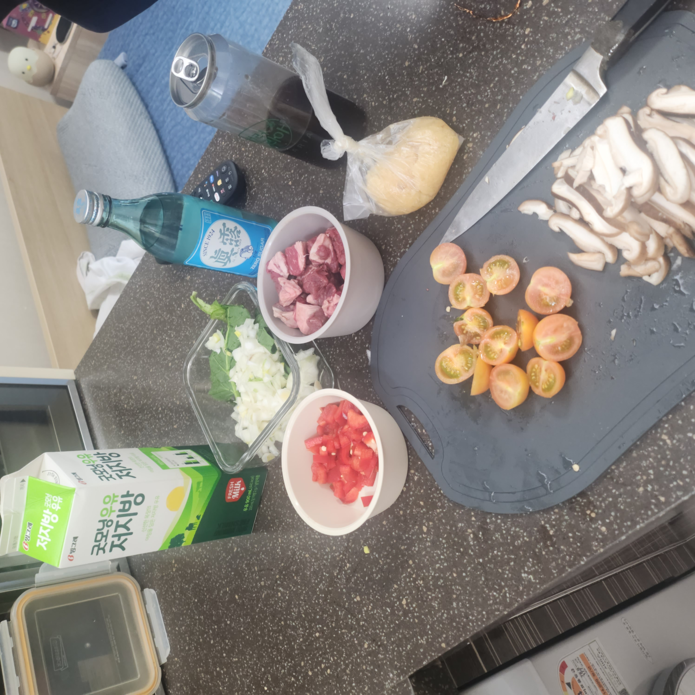

> Frittata, the best egg-based Italian dish...

**Step 1. Prepare ingredients.** 
Ingredients
spinach, beef, bell pepper, cherry tomatoes, shiitake mushrooms, onion, minced garlic, salt, milk, eggs

--------------------------------

**Step 2. Sauté!!!** 
Heat some oil in a frying pan and sauté the spinach, onion, minced garlic, and bell pepper.

--------------------------------

**Step 3. Making batter...** 
Crack 3 eggs into a bowl, add 100mL of milk, and a pinch of salt. Mix everything together to make a batter.

--------------------------------

**Step 4. Pour it all in** 
Pour the batter into the frying pan and add some beef, cherry tomatoes, and shiitake mushrooms.

--------------------------------

**Step 5. Stuff it in!!** 
Press the ingredients down gently to ensure the batter covers everything.

--------------------------------

**Step 6. Time to be patient...** 
Cover the frying pan with a lid and cook on low heat for 15–20 minutes.

--------------------------------

**Step 7. Enjoy!** 
Your fritta is ready. Enjoy!

--------------------------------
