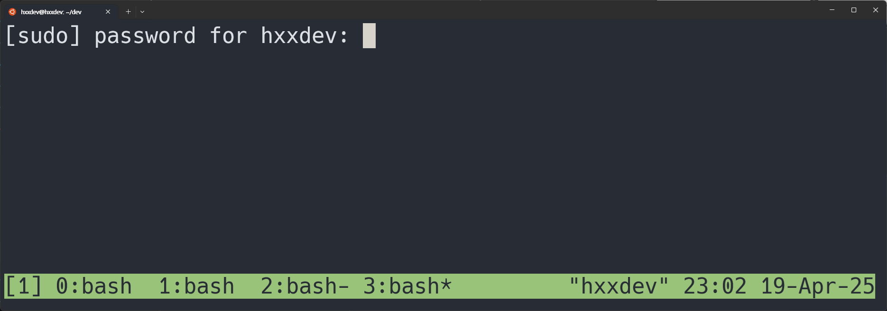

This post explains about **what tmux is, how to install tmux and use tmux**.

-----------------------------------

### Installation

If you are using Ubuntu, `tmux` can be installed using command:

```shell
sudo apt-get install tmux
```

-----------------------------------

### Concept


rectangle "session" as session1
rectangle "session" as session2
rectangle "window" as window1
rectangle "window" as window2
rectangle "window" as window3
rectangle "window" as window4
rectangle "pane" as pane1
rectangle "pane" as pane2
rectangle "pane" as pane3
rectangle "pane" as pane4
rectangle "pane" as pane5
rectangle "pane" as pane6
rectangle "pane" as pane7


session1 -down-> window1
session1 -down-> window2
session2 -down-> window3
session2 -down-> window4
window1 -down-> pane1
window1 -down-> pane2
window2 -down-> pane3
window3 -down-> pane4
window3 -down-> pane5
window3 -down-> pane6
window4 -down-> pane7


Using `tmux`, you can make many **sessions**.  
A single **session** can have a lot of **windows**.  
A single **window** can again have a lot of **panes**.  

Run `tmux` in the terminal.  
The bottom green status bar will show up. It indicates the **session name** and **the windows in the session**.  

{: width="300" .left}

- `[1]` indicates the session name.
- `Session 1` has **4 windows**.
- The asterix(`*`) next to `window 3` indicates the window that is displayed on the terminal.

-----------------------------------

### Commands

#### Sessions

|command|description|
|:-:|:-|
|`tmux`| run tmux.|
|`ctrl-b :new`| make new session.|
|`ctrl-b :kill-session`| kill session.|
|`ctrl-b s` - `t` - `X`| kill tagged session(s).|
|`ctrl-b s`| change session.|
|`ctrl-b w`| change session/window.|
|`ctrl-b $`| rename session.|

#### Windows

|command|description|
|:-:|:-|
|`ctrl-b c` | create window.|
|`ctrl-b n` | go to next window.|
|`ctrl-b p` | go to previous window.|
|`ctrl-b w`| change session/window.|
|`ctrl-b ,` | rename window/pane. |
|`ctrl-b d` | close window/pane. |

#### Panes

|command|description|
|:-:|:-|
|`ctrl-b %` | split horizontal pane. |
|`ctrl-b "` | split vertical pane. |
|`ctrl-b d` | close window/pane. |

#### Others

|command|description|
|:-:|:-|
|`ctrl-b [` | scroll mode. `q` to quit. |
|`ctrl-b Pgup` | scroll mode. go one page up. `q` to quit. |

-----------------------------------

#### Shortcuts

Shortcuts can be configured in `~/.tmux.conf`.

```
# switch between windows
bind-key -n C-S-Left previous-window
bind-key -n C-S-Right next-window

# resize panes
set -g repeat-time 1500
bind-key -nr -T prefix       M-Up              resize-pane -U 5
bind-key -nr -T prefix       M-Down            resize-pane -D 5
bind-key -nr -T prefix       M-Left            resize-pane -L 5
bind-key -nr -T prefix       M-Right           resize-pane -R 5
bind-key -nr -T prefix       C-Up              resize-pane -U
bind-key -nr -T prefix       C-Down            resize-pane -D
bind-key -nr -T prefix       C-Left            resize-pane -L
bind-key -nr -T prefix       C-Right           resize-pane -R
```

- `-n`: No prefix — This tells tmux that the key binding should not require the prefix key (usually Ctrl+b by default). So pressing just the key will trigger the binding.

- `-r`: Repeatable — This allows the key binding to be repeated when the key is held down, similar to how holding down an arrow key scrolls continuously.
