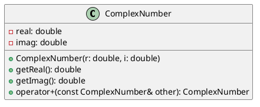
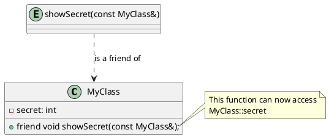

### Operator Overloading and Friend Functions

Today, we're tackling one of C++'s most powerful and sometimes controversial features: **Operator Overloading**.

This mechanism allows you to redefine the meaning of operators like `+`, `==`, and `<<` for your own custom types. When used wisely, it can make your code dramatically more intuitive and readable.

We'll also explore **friend functions**, a related concept that gives you fine-grained control over class encapsulation.

Let's get started!

---

#### 1. What is Operator Overloading?

In C++, operators are symbols that specify an action to be performed. You use `+` to add numbers, `==` to compare them, and so on. But what if you want to "add" two `Vector` objects, or compare two `Book` objects for equality?

**Operator overloading** lets you provide a special meaning for an operator in a specific context—your custom class. It allows you to use familiar symbols for operations on your types, making the code cleaner and more aligned with the problem domain.

Consider a `Currency` class that represents a monetary value. Which of these is more readable?

```cpp
// Option 1: Using a named function
Currency total = wallet.add(price);

// Option 2: Using an overloaded operator
Currency total = wallet + price;
```

Most would agree that the second option is more natural and concise. This is the core benefit of operator overloading. We've all seen this in action with the `std::string` class, where `+` concatenates strings and `==` compares them.

##### Which Operators Can Be Overloaded?

You can overload most C++ operators. However, a few are off-limits because they are fundamental to the language's structure and changing their behavior would lead to chaos.

**You CANNOT overload:**
*   `::` (Scope Resolution)
*   `.` (Member Access)
*   `.*` (Member Access through pointer-to-member)
*   `?:` (Ternary Conditional)
*   `sizeof`
*   `typeid`

---

#### 2. The Mechanics of Overloading

Overloading an operator is like defining a special function. The function's name is the keyword `operator` followed by the symbol you're overloading.

```cpp
// General syntax for a member function
ReturnType ClassName::operator@(Parameters) {
    // Implementation
}
```

These operator functions can be defined in two ways:
1.  **As class member functions.**
2.  **As non-member functions** (which often need to be `friend`s to access private data).

Let's dive into specific examples.

##### Example 1: Arithmetic Operators (`+`) with a `ComplexNumber` Class

A complex number (a + bi) is a perfect candidate for operator overloading. Let's define a class and overload the `+` operator as a member function.



When you write `c1 + c2`, where `c1` and `c2` are `ComplexNumber` objects, the compiler translates it into a member function call: `c1.operator+(c2)`. The left-hand operand (`c1`) becomes the object that invokes the method, and the right-hand operand (`c2`) is passed as an argument.

Here's the implementation:

```cpp
#include <iostream>

class ComplexNumber {
private:
    double real;
    double imag;

public:
    ComplexNumber(double r = 0.0, double i = 0.0) : real(r), imag(i) {}

    // Overload the + operator
    ComplexNumber operator+(const ComplexNumber& other) const {
        // Create a new ComplexNumber to return the result
        return ComplexNumber(real + other.real, imag + other.imag);
    }

    void print() const {
        std::cout << real << " + " << imag << "i" << std::endl;
    }
};

int main() {
    ComplexNumber c1(3.0, 4.0); // 3 + 4i
    ComplexNumber c2(1.0, 2.0); // 1 + 2i

    ComplexNumber result = c1 + c2; // Invokes c1.operator+(c2)

    std::cout << "Result: ";
    result.print(); // Should print "4 + 6i"
    return 0;
}
```

##### Example 2: Comparison Operators (`==`)

Let's define a `Book` class and check for equality based on the ISBN.

```cpp
#include <iostream>
#include <string>

class Book {
private:
    std::string title;
    std::string author;
    std::string isbn;

public:
    Book(std::string t, std::string a, std::string i)
        : title(t), author(a), isbn(i) {}

    // Overload the == operator
    bool operator==(const Book& other) const {
        return this->isbn == other.isbn;
    }
};

int main() {
    Book b1("The C++ Programming Language", "Bjarne Stroustrup", "978-0321563842");
    Book b2("Effective Modern C++", "Scott Meyers", "978-1491903995");
    Book b3("The C++ Programming Language", "B. Stroustrup", "978-0321563842");

    if (b1 == b3) { // Invokes b1.operator==(b3)
        std::cout << "b1 and b3 are the same book (based on ISBN)." << std::endl;
    } else {
        std::cout << "b1 and b3 are different books." << std::endl;
    }
    return 0;
}
```
**Best Practice:** If you overload `==`, it's good practice to also overload `!=` for consistency.

---

#### 3. The Special Case of Increment/Decrement (`++`)

The `++` and `--` operators are unique because they have pre-increment (`++c`) and post-increment (`c++`) versions.
How do we tell them apart?

C++ uses a clever trick: the post-increment version takes a dummy `int` parameter.

*   **Pre-increment (`operator++()`):** Modifies the object and returns a reference to the *modified* object.
*   **Post-increment (`operator++(int)`):** Modifies the object but returns a copy of the object *before* it was modified.

Let's see this with a `Counter` class.

```cpp
#include <iostream>

class Counter {
private:
    int value;

public:
    Counter(int v = 0) : value(v) {}

    // Pre-increment: ++c
    Counter& operator++() {
        value++;
        return *this; // Return a reference to the modified object
    }

    // Post-increment: c++
    Counter operator++(int) {
        Counter temp = *this; // Create a copy of the current state
        value++;              // Increment the original object
        return temp;          // Return the copy
    }

    int getValue() const { return value; }
};

int main() {
    Counter c1; // Starts at 0
    std::cout << "Initial value: " << c1.getValue() << std::endl;

    Counter c2 = ++c1; // Pre-increment
    std::cout << "After ++c1:" << std::endl;
    std::cout << "c1 is " << c1.getValue() << std::endl; // 1
    std::cout << "c2 is " << c2.getValue() << std::endl; // 1

    Counter c3 = c1++; // Post-increment
    std::cout << "After c1++:" << std::endl;
    std::cout << "c1 is " << c1.getValue() << std::endl; // 2
    std::cout << "c3 is " << c3.getValue() << std::endl; // 1 (the old value)
    return 0;
}
```
**Performance Note:** The post-increment operator is slightly less efficient because it requires creating a temporary copy. For non-trivial classes, prefer pre-increment in loops (`for (int i=0; ...; ++i)`) if the old value isn't needed.

---

#### 4. Friend Functions: A Controlled Breach of Encapsulation

Encapsulation—hiding a class's internal data—is a cornerstone of OOP. But sometimes, a function or another class needs special access to a class's `private` or `protected` members. This is where the `friend` keyword comes in.

A class can declare a function or another class as a `friend`. This grants the friend access to all its members, regardless of their access specifier.

Here are a few key points about declaring friends:
*   The `friend` declaration can be placed anywhere within the class definition (`public`, `private`, or `protected`), as it is not affected by access specifiers. It's common practice to group friend declarations at the top of the class.
*   A `friend` function is **not a member function**, even though its prototype is declared inside the class.
*   The function's body must be defined outside the class definition, without the `friend` keyword or the class scope `::`.



##### When to Use Friends?

The most common use case for friend functions is **overloading binary operators where the class instance is not the left-hand operand**. The stream insertion (`<<`) and extraction (`>>`) operators are the classic examples.

Consider `std::cout << myObject;`. The left-hand operand is `std::cout`, which is an `ostream` object, not an object of `MyClass`. You can't add a member function to the `ostream` class.

The solution is to implement `operator<<` as a non-member function. And since it needs to access `myObject`'s private data for printing, `MyClass` must declare it as a `friend`.

##### Example 3: Overloading `<<` with a Friend Function

Let's make our `ComplexNumber` class printable with `std::cout`.

```cpp
#include <iostream>

class ComplexNumber {
private:
    double real;
    double imag;

public:
    ComplexNumber(double r = 0.0, double i = 0.0) : real(r), imag(i) {}

    // Declare the non-member operator<< as a friend
    friend std::ostream& operator<<(std::ostream& os, const ComplexNumber& c);
};

// Define the friend function (outside the class)
std::ostream& operator<<(std::ostream& os, const ComplexNumber& c) {
    os << c.real << " + " << c.imag << "i";
    return os; // Return the ostream to allow chaining (e.g., cout << c1 << c2)
}

int main() {
    ComplexNumber c1(3.0, 4.0);
    ComplexNumber c2(1.0, 2.0);

    std::cout << "c1 is " << c1 << std::endl;
    std::cout << "c2 is " << c2 << std::endl;
    return 0;
}
```

**Key Points for `operator<<`:**
1.  It must be a non-member function.
2.  It takes the stream (`ostream&`) as the first parameter and the object to print (`const YourClass&`) as the second.
3.  It must be declared as a `friend` if it needs to access private members.
4.  It must return a reference to the stream (`ostream&`) to enable chaining.

##### Member vs. Friend Functions: Which to Choose?
Member functions and friend functions can sometimes accomplish similar tasks. So when should you choose one over the other? Here’s a general guideline:

*   **Define as a member function if:** The operation is conceptually tied to a single object (e.g., modifying its state, like `operator++`). Unary operators are a good example.
*   **Consider a friend function if:** The operation involves two or more distinct objects and needs access to their private members (e.g., a function that compares two different types of objects).

Of course, you can often achieve the same result using public accessor methods (getters/setters) instead of a friend function. However, a friend function can be more direct and efficient.

**A Word of Caution:** Remember that `friend` functions and classes break the principle of encapsulation. They should be used sparingly and only when there is a clear benefit that cannot be achieved reasonably with member functions or public interfaces.

---

#### 5. Advanced Topics: Assignment, Subscript, and Pointer Operators

##### Assignment Operator (`=`)
If you don't provide one, the compiler generates a default assignment operator that performs a member-wise copy. This is fine for simple classes but leads to **shallow copy** problems if your class manages dynamic memory. In such cases, you must provide a custom assignment operator to perform a **deep copy**.

A key rule for the assignment operator is that it **must return a reference to the current object** (e.g., `MyClass&`). This is because the assignment operator can be chained together.

Consider a chained assignment:
```cpp
a = b = c;
```
Because assignment is right-associative, this statement is parsed as `a = (b = c);`. The process is:
1.  `b.operator=(c)` is called. This assigns the contents of `c` to `b`.
2.  The function then returns a reference to `b`.
3.  The statement becomes `a = b;`, and `a.operator=(b)` is called, completing the chain.

Without returning a reference from `operator=`, this kind of intuitive, chained assignment would not be possible.

##### Subscript Operator (`[]`)
The `[]` operator is used to provide array-like access. It's typically overloaded to return a reference, allowing the result to be used on the left side of an assignment (`myArray[5] = 10;`). You should also provide a `const` version for read-only access on `const` objects.

##### Pointer-like Operators (`*` and `->`)
Overloading the dereference (`*`) and member access (`->`) operators is the magic behind **smart pointers** (`std::unique_ptr`, `std::shared_ptr`). These classes act like raw pointers but manage the lifetime of the memory they point to, preventing memory leaks.

---

#### Conclusion and Best Practices

Operator overloading is a powerful tool for creating expressive, intuitive APIs in C++.

*   **Be Intuitive:** Overload an operator only when its meaning is clear and unambiguous. Use `+` for addition-like operations, not for something random.
*   **Be Consistent:** If you overload `+`, consider overloading `+=`. If you overload `==`, also overload `!=`.
*   **Member vs. Non-Member:**
    *   Use **member functions** for operators that modify the state of the object (`=`, `+=`, `++`).
    *   Use **non-member functions** (often `friend`s) for binary operators where the left-hand operand might not be a class object (like `<<`) or when you want symmetric conversions.
*   **Follow Conventions:** The return types and parameters for operators like `<<`, `++`, and `=` have established patterns. Stick to them.
*   **Use `friend` Sparingly:** `friend` breaks encapsulation. Use it only when necessary, primarily for operator overloading as described above.

By following these guidelines, you can leverage operator overloading to write C++ code that is not only powerful but also a pleasure to read and use.
